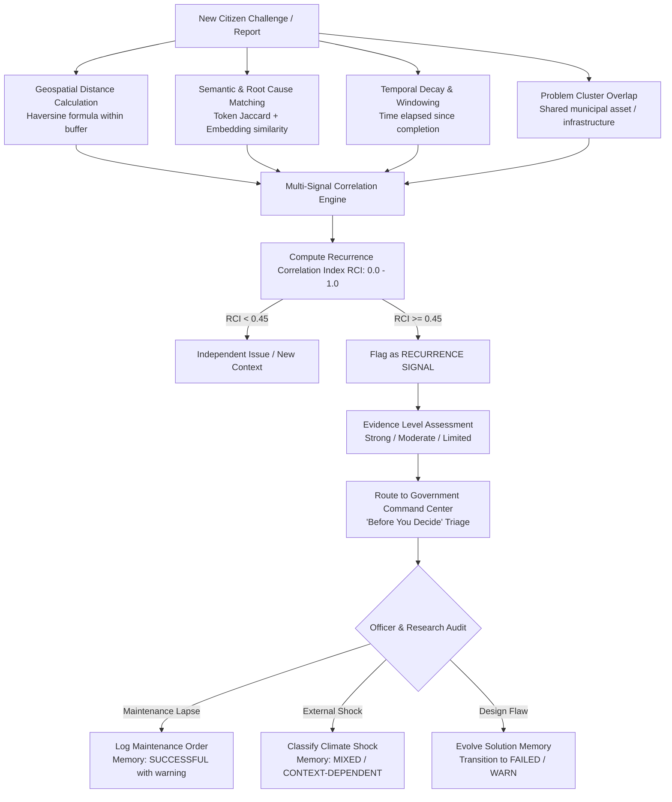
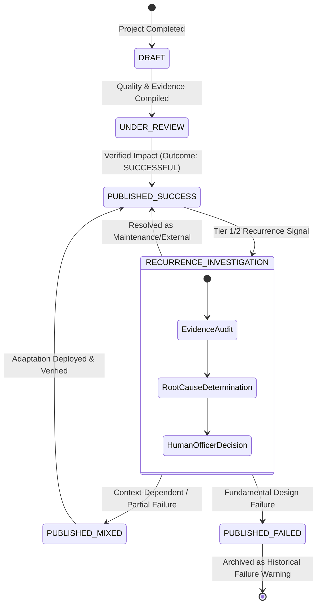

# SICP — Solution Memory: Recurrence Intelligence & Outcome Evolution Logic

**Document Version:** 1.0.0  
**Author:** SICP Institutional Intelligence & System Architecture Team  
**Status:** Approved System Specification  

---

## 1. Core Governance Principle

> **THE SICP GOVERNANCE INVARIANT:**  
> **`same location + same complaint` does NOT equal `solution failed`.**  
> A new citizen complaint or physical observation at an intervention site is strictly classified as a **`RECURRENCE SIGNAL`**, requiring multi-signal evidence corroboration, contextual root-cause analysis, and human officer adjudication.

In civic infrastructure and public service delivery, automated classification of repeat complaints as "engineering failures" produces false alarms, disincentivizes innovation, and obscures true operational dynamics. A recurrent issue may arise from:
1. **Unprecedented External Shock**: A 100-year flood event overwhelming a stormwater drain designed for 10-year peaks.
2. **Maintenance Deficit**: A sensor network failing because municipal battery replacement schedules were not funded.
3. **Adoption & Behavioral Factors**: Citizens vandalizing solar streetlight batteries or dumping non-biodegradable solid waste into biological treatment wetlands.
4. **Implementation Shortfall**: Sub-contractor pouring inadequate grade concrete, rather than flaw in the engineering blueprint.
5. **Fundamental Technology Flaw**: Membrane fouling in hard-water reverse osmosis systems proving economically unviable.

Under SICP governance:
- **AI = Understanding & Signal Correlation** (detecting patterns across space, time, and semantics).
- **Algorithms = Deterministic Computation** (calculating distance, decay, similarity, cluster weights).
- **Rules = Policy Guardrails** (mandatory review, evidence quality thresholds).
- **Humans = Final Authority** (Municipal Commissioner / Lead Faculty / Chief Engineer validates outcome transitions).

---

## 2. Multi-Signal Recurrence Correlation Architecture

When a new challenge or citizen report is ingested, the system computes a multi-dimensional correlation matrix against historical interventions and completed projects.

### 2.1 Mathematical Correlation Model

The **Recurrence Correlation Index ($RCI$)** is evaluated as:

$$RCI = w_s \cdot S_{spatial} + w_t \cdot S_{semantic} + w_r \cdot S_{root\_cause} + w_a \cdot S_{temporal} + w_c \cdot S_{cluster}$$

Where:
- $w_s = 0.30$ (Geospatial Proximity)
- $w_t = 0.25$ (Semantic Problem Statement Similarity)
- $w_r = 0.20$ (Root Cause Hypothesis Alignment)
- $w_a = 0.15$ (Temporal Recurrence Window)
- $w_c = 0.10$ (Direct Asset/Cluster Linkage)

#### 1. Spatial Proximity Function ($S_{spatial}$)
Calculated using the great-circle Haversine formula:
- $d \le 0.25\text{ km}$ (Immediate site / same ward block): $S_{spatial} = 1.00$
- $0.25\text{ km} < d \le 1.0\text{ km}$ (Immediate neighborhood / same feeder line): $S_{spatial} = 0.85$
- $1.0\text{ km} < d \le 3.0\text{ km}$ (Same municipal ward): $S_{spatial} = 0.60$
- $3.0\text{ km} < d \le 10.0\text{ km}$ (Same district catchment): $S_{spatial} = 0.30$
- $d > 10.0\text{ km}$: $S_{spatial} = 0.00$

#### 2. Temporal Window Function ($S_{temporal}$)
Evaluates post-completion elapsed time ($T$ in months):
- $T < 1\text{ month}$: High early-infant mortality signal ($S_{temporal} = 1.00$)
- $1 \le T \le 6\text{ months}$: Warranty / pilot stabilization window ($S_{temporal} = 0.85$)
- $6 < T \le 24\text{ months}$: Standard operational lifecycle ($S_{temporal} = 0.65$)
- $24 < T \le 60\text{ months}$: Lifecycle maintenance phase ($S_{temporal} = 0.40$)
- $T > 60\text{ months}$: Expected asset depreciation ($S_{temporal} = 0.15$)

---

## 3. Evidence Quality Tiers

Before any recurrence signal can influence the institutional memory rating of a solution, the supporting evidence must be graded:

| Evidence Tier | Criteria | System Confidence | Permitted Action |
| :--- | :--- | :--- | :--- |
| **Tier 1: STRONG** | Multi-source verification: Physical on-site municipal audit, geotagged & timestamped photo evidence, sensor telemetry breach, or $\ge 5$ corroborated citizen reports with high spatial coherence. | $0.90 - 1.00$ | Authorizes officer to trigger formal Solution Memory Review and potential outcome reclassification. |
| **Tier 2: MODERATE** | $2 - 4$ citizen reports with photographic evidence, or single report verified by recognized community group / university observer. | $0.65 - 0.89$ | Emits `RECURRENCE SIGNAL` alert in Government Command Center; flags "Operational Investigation Recommended". |
| **Tier 3: LIMITED** | Single unverified citizen report, vague description, or conflicting sensory evidence. | $0.30 - 0.64$ | Logged as advisory note only; no modification to solution memory score or status. |

---

## 4. Closed-Loop Outcome Evolution State Machine

Historical Solution Memories are living institutional assets. When new evidence or recurrence investigations conclude, their status evolves according to a deterministic state machine governed by human sign-off:

### 4.1 Outcome Status Transitions & Meaning

1. **`SUCCESSFUL` (🟢 WORKED BEFORE — "Recommend as reference")**
   - High reusability score ($\ge 80$).
   - Verified target impact achieved across multiple deployments.
   - Low failure count relative to total implementations ($< 15\%$).
   - **Guidance Action**: Recommend directly as blueprint to university/industry teams.

2. **`FAILED` (🔴 FAILED BEFORE — "Warn about previous failure")**
   - Verified failure factors documented (e.g. fatal chemical incompatibility, unmanageable lifecycle cost).
   - High recurrence of failure ($> 60\%$) under standard municipal operating conditions.
   - **Guidance Action**: Display prominent red warning banner; require justification to reuse.

3. **`PARTIALLY_EFFECTIVE` / `MIXED` (🟡 MIXED RESULTS — "Use with caution")**
   - Succeeded in specific socio-technical contexts (e.g. rural low-flow water table) but struggled in others (dense urban blackwater).
   - Dependent on strict maintenance prerequisites or institutional capacity.
   - **Guidance Action**: Surface prerequisites and known boundary conditions.

4. **`REQUIRES_REVIEW` (⚪ REQUIRES REVIEW — "Insufficient evidence")**
   - Unresolved recurrence investigations or pilot outcomes under audit.
   - **Guidance Action**: Flag as unverified baseline; recommend targeted field evaluation.

---

## 5. Audit & Compliance Log
Every outcome evolution and recurrence investigation records:
- `actorId`: User ID of authorizing government officer or faculty reviewer.
- `action`: `SOLUTION_MEMORY_STATUS_UPDATE` or `RECURRENCE_INVESTIGATION_COMPLETED`.
- `previousState` & `newState`.
- `reasonNotes`: Mandatory substantive justification.
- `timestamp`: ISO 8601 server timestamp.
